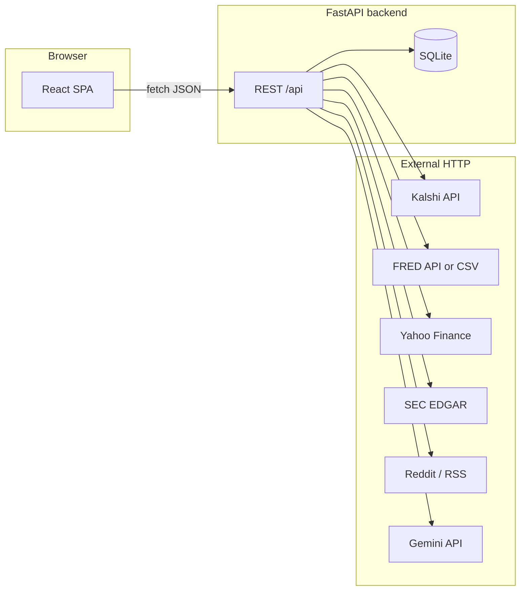

# PreTerm — developer & product manual (`DEV.md`)

This file is **`DEMO.md` (full product depth) plus Part II (engineering)**. Engineers should treat it as the **single longest** reference; product reviewers can read **Part I only** (same content as `DEMO.md`).

| Part | Contents |
|------|-----------|
| **Part I** (below through Maintainer note) | Every page, control, flow, validation, empty state, demo script—identical to `docs/DEMO.md`. |
| **Part II** (after Maintainer note) | Stack, repo layout, env vars, HTTP API, DB schema, market pipeline, integrations, frontend architecture, ops, troubleshooting. |

**Maintenance:** When **UI or copy** changes, update **`DEMO.md` and Part I here** (keep them aligned—copy-paste Part I from `DEMO.md` if needed). When **APIs, schema, or config** change, update **Part II** and adjust Part I only if user-visible behavior changed.

---

## Part I — Product surface (same as `DEMO.md`)

---

## Table of contents (Part I)

1. [What PreTerm is (one paragraph)](#what-preterm-is-one-paragraph)
2. [Vocabulary (read this first)](#vocabulary-read-this-first)
3. [What is saved where (persistence)](#what-is-saved-where-persistence)
4. [Routes you can land on](#routes-you-can-land-on)
5. [Boot and auth behavior](#boot-and-auth-behavior)
6. [Sign in](#sign-in)
7. [Register](#register)
8. [The workstation shell (every authenticated page)](#the-workstation-shell-every-authenticated-page)
9. [Market Copilot (right column)](#market-copilot-right-column)
10. [Monitor — contract grid](#monitor--contract-grid)
11. [Monitor — contract detail](#monitor--contract-detail)
12. [Watchlists](#watchlists)
13. [Headlines](#headlines)
14. [Research](#research)
15. [Planner](#planner)
16. [Settings](#settings)
17. [Cross-desk workflows (storyboards)](#cross-desk-workflows-storyboards)
18. [Validation and disabled rules (quick matrix)](#validation-and-disabled-rules-quick-matrix)
19. [Empty states and system messages (catalog)](#empty-states-and-system-messages-catalog)
20. [Visual language (what colors and badges mean)](#visual-language-what-colors-and-badges-mean)
21. [Personas — “a day in the life”](#personas--a-day-in-the-life)
22. [Extended demo script (step-by-step)](#extended-demo-script-step-by-step)
23. [FAQ (user confusion)](#faq-user-confusion)
24. [Appendix — sample content shipped in the UI](#appendix--sample-content-shipped-in-the-ui)
25. [Reading order (how to scan each screen)](#reading-order-how-to-scan-each-screen-without-getting-lost)
26. [Worked example — reading one card](#worked-example--reading-one-card-in-english)
27. [Narration cues (demo talk track snippets)](#narration-cues-what-to-say-aloud-while-demoing)

**Part II — Engineering** (after [Maintainer note (Part I)](#maintainer-note-part-i)):

28. [Part II table of contents](#part-ii-table-of-contents)
29. [System context](#system-context)
30. [Repository layout](#repository-layout)
31. [Technology stack & versions](#technology-stack--versions)
32. [Build, run, and scripts](#build-run-and-scripts)
33. [Configuration & environment](#configuration--environment)
34. [Backend application entry](#backend-application-entry)
35. [HTTP API reference](#http-api-reference)
36. [Authentication & authorization](#authentication--authorization)
37. [Database & SQLAlchemy models](#database--sqlalchemy-models)
38. [Market data pipeline](#market-data-pipeline)
39. [Briefs, timeline, and snapshots](#briefs-timeline-and-snapshots)
40. [Macro (FRED) implementation](#macro-fred-implementation)
41. [Finance (Yahoo & EDGAR) implementation](#finance-yahoo--edgar-implementation)
42. [Headlines mapping implementation](#headlines-mapping-implementation)
43. [Sentiment & news feeds](#sentiment--news-feeds)
44. [Planner, watchlists, saved views, alerts](#planner-watchlists-saved-views-alerts)
45. [Copilot (LLM) implementation](#copilot-llm-implementation)
46. [Frontend architecture](#frontend-architecture)
47. [Production static hosting](#production-static-hosting)
48. [Troubleshooting (engineering)](#troubleshooting-engineering)
49. [Security notes](#security-notes)
50. [Codebase map (file → responsibility)](#codebase-map-file--responsibility)
51. [Deep dive — market refresh mechanics](#deep-dive--market-refresh-mechanics)
52. [Deep dive — JWT and auth payloads](#deep-dive--jwt-and-auth-payloads)
53. [Deep dive — Pydantic schemas](#deep-dive--pydantic-schemas-where-to-look)
54. [Deep dive — frontend module map](#deep-dive--frontend-module-map)
55. [Deep dive — headline scoring](#deep-dive--headline-scoring-developer-mental-model)
56. [Deep dive — planner suggestions](#deep-dive--planner-suggestions-algorithm-sketch)
57. [Deep dive — SEC / EDGAR client](#deep-dive--sec--edgar-client)
58. [Deep dive — FRED CSV discovery](#deep-dive--fred-csv-discovery)
59. [Testing & CI](#testing--ci)

---

## What PreTerm is (one paragraph)

PreTerm is a **prediction-market workstation**: a single place to **watch binary contracts** (each shown as an **implied probability** that the “yes” outcome happens under the exchange’s rules), **read structured briefs** (what matters, what changed, bull/base/bear, catalysts, risks), **map headlines and feeds to the right contract**, **run sentiment on text or URLs or a subreddit’s hot page**, **research equities and SEC filings and macro indicators** beside that work, **save lists and whole desk layouts**, **plan real-world dates** with suggested contracts to watch, **tune alerts**, and **ask a Copilot** that is aware of your selected contract, pins, watchlists, and your last headline map.

---

## Vocabulary (read this first)

**Contract / market (in the UI)**  
A tradable binary question with a title, category, status, optional close time, and a price that PreTerm displays as **implied yes** (0–100%). This is **not** a claim that the world will turn out a certain way; it is the **market’s current consensus** shaped by participants and liquidity.

**Implied yes (shown as a big %)**  
The midpoint of “how the market prices a yes right now,” stored internally as a fraction and **rounded to a whole percent** almost everywhere in the UI.

**Points / pts (move)**  
**Percentage points** of implied yes, not “percent return.” Example: 61% to 64% is **+3 pts**, not “+3%.”

**Pin (to desk)**  
A **temporary focus flag** kept in the app while you work. Pinned contracts power the **Pinned** view on Monitor and feed **smart sort** and **Copilot**. Pins are **not** automatically saved to the server; see [Persistence](#what-is-saved-where-persistence).

**Watchlist**  
A **named, server-saved list** of contracts. Used for persistence, alert logic, and smart ordering when you enable it.

**Saved view**  
A **snapshot of your Monitor layout**: desk mode, category filter, search text, selected contract id, and pin list. Reopening a saved view **rehydrates** that working state and navigates you back into Monitor (optionally straight into a chosen contract).

**Desk mode (View)**  
- **All** — browse everything that passes filters.  
- **Pinned** — only contracts you pinned.  
- **Closing** — same filter set, but **sorted by soonest close time** (contracts without a date sort last).

**Smart sort**  
Optional reordering of the **All** or **Pinned** lists using **pins**, **watchlist membership**, and **recent detail opens** recorded in this browser. **Turns off** while **Closing** view is active, because closing order is authoritative.

**Event brief**  
Structured narrative blocks attached to a contract: summary, why now, what changed, drivers, catalysts, risks, scenario cases, “what would change probability,” optional curated headlines, and reference chips.

**Headline map**  
You paste or choose a headline; PreTerm suggests **which contract** the text is about and a **directional impact** label (e.g. whether the narrative is “good for yes” or “bad for yes” in a coarse sense—always interpret with judgment).

**Headline map session (for Copilot)**  
After a successful map, the app remembers the **headline text** and **full result** until replaced. Copilot can read that memory even if you navigate away from Headlines.

**Live wire**  
On Headlines, quick pulls of **Reddit hot** or **BBC World RSS** that populate clickable lines you can feed into mapping.

**Research desk**  
Standalone **equity quote + headlines + SEC** and **macro charts**—you do **not** have to pick a Kalshi contract first.

**Planner event**  
A dated real-world thing (wedding, trip, game, policy date, etc.) with a **concern type**; PreTerm suggests contracts that **overlap** with that concern in language and theme.

**Alerts / Notifications**  
Rules you configure in Settings can create **notification cards** you open from the header tray. You can **mark read** per item.

---

## What is saved where (persistence)

**On the server (survives new device, new browser, if you log in again)**  
- Your **account** (login).  
- **Watchlists** and their members.  
- **Saved views** (monitor snapshots).  
- **Planner events** and their stored suggestion payloads.  
- **Alert preferences** and **notification** history (as implemented).

**In this browser only (survives refresh, not a new device)**  
- Whether **smart sort** is turned on.  
- A **recent-opens history** used to bump contracts you looked at recently toward the top when smart sort is on.

**In memory for this tab session (lost on full reload unless captured in a Saved View)**  
- **Desk mode**, **category filter**, **search query**.  
- **Pinned market ids**.  
- **Selected market id** (what Monitor and Copilot treat as “selected”).  
- **Headline map session** (until you replace it or restart the SPA—provider is in-memory).

**Practical demo tip**  
If you **pin** contracts and want to **survive a refresh**, teach users to **Save Current Monitor Configuration** on Watchlists, or add important markets to a **watchlist** and rely on smart sort after reload.

---

## Routes you can land on

| URL | What it is |
|-----|------------|
| `/` | Redirects to `/app/monitor`. |
| `/login` | Sign-in screen (also used when auth is required). |
| `/register` | Create account. |
| `/app` | Redirects to `/app/monitor`. |
| `/app/monitor` | Contract grid (Monitor). |
| `/app/monitor/:id` | One contract, full detail. |
| `/app/watchlists` | Lists, quick add, saved views. |
| `/app/headlines` | Headline map + sentiment. |
| `/app/research` | Equities + macro. |
| `/app/planner` | Planner. |
| `/app/settings` | Profile snapshot + alerts. |
| Anything else unknown | Redirects to `/app/monitor`. |

---

## Boot and auth behavior

**“Loading PreTerm workspace…”**  
Full-screen message while auth state is **bootstrapping** (token check). Shown on **protected** routes and on **Login/Register** until bootstrap finishes.

**Protected `/app/*`**  
If not authenticated, you are sent to **Login** and the app **remembers which page you wanted** (e.g. Watchlists). After you sign in, it takes you **there** instead of the default Monitor.

**Login/Register while already signed in**  
Those pages use a **public-only** gate: if you are already authenticated, you are redirected to **`/app/monitor`** (you do not need to log in again).

---

## Sign in

**Page layout**  
Split **hero** (left) + **card** (right).

**Hero — eyebrow**  
“Desk Access”

**Hero — title**  
“PreTerm”

**Hero — body**  
“A prediction-market workstation for tracking live contracts, interpreting events, and keeping important decisions tied to the right market signals.”

**Hero — bullets**

1. “Monitor active contracts and save your desk state”
2. “Read event briefs, scenarios, and move timelines in one place”
3. “Map headlines and planning risks directly into relevant markets”

**Card — eyebrow**  
“Sign In”

**Card — title**  
“Open your desk”

**Card — subtitle**  
“Sign in with your account or use the prefilled demo credentials below.”

**Fields**

- **Email** — required. In many demos this arrives **prefilled** with the seeded demo address.
- **Password** — required. Often prefilled in demos.

**Primary action**

- **Sign In** — submits the form. Label becomes **“Signing In…”** and the button is **disabled** while the request runs.

**Failure**  
Red **form error** above the button with the server/message text (e.g. bad password).

**Footer**  
“Need an account? **Create one**” — navigates to Register.

**Success**  
Navigates to **Monitor** or back to the **page you originally tried to open**.

---

## Register

**Hero — eyebrow**  
“Registration”

**Hero — title**  
“Create your workspace”

**Hero — body**  
“Create an account to save watchlists, planner events, alert settings, and your preferred desk setup.”

**Card — eyebrow**  
“Create Account”

**Card — title**  
“Register for PreTerm”

**Card — subtitle**  
“Set up your account and start with a personalized prediction-market workspace.”

**Fields**

- **Display Name** — required.
- **Email** — required, email.
- **Password** — required, **minimum 8 characters**.

**Primary action**

- **Create Account** → **“Creating Account…”** while submitting; disabled during submit.

**Footer**  
“Already have an account? **Sign in**”

**Success**  
Goes to **`/app/monitor`**.

---

## The workstation shell (every authenticated page)

### Left rail — brand

- Square **“PT”** mark.
- Eyebrow: **“Prediction Market Workstation”**
- Product name: **“PreTerm”** (top-level heading in the rail).

### Left rail — identity card

- Kicker: **“Signed In”**
- **Bold display name**
- **Email** line.
- **Focus** line: shows your profile’s default focus label, or **“General desk”** if none is set.

### Left rail — navigation

Six **navigation links**. Each row:

- **Primary label** (larger)
- **Hint** (smaller)

Exact pairs:

1. **Monitor** — “Core workstation”
2. **Watchlists** — “Saved focus sets”
3. **Headlines** — “News mapping desk”
4. **Research** — “Stocks, SEC, macro”
5. **Planner** — “Hedge planning”
6. **Settings** — “Profile and preferences”

**Active route styling**  
The current page’s link is **visually highlighted**. When you drill into a contract at **`/app/monitor/123`**, the **Monitor** item **stays** highlighted so you know you are still in the Monitor “family.”

### Left rail — feed card

- Kicker: **“Feed”**
- Copy: **“Markets refresh on a timer when Kalshi is enabled. Pins stay in this browser session.”** (Meaning: live prices may update on a schedule; pin state is **session/workspace state**, not a server pin—pair this with [Persistence](#what-is-saved-where-persistence).)

### Top header — page meta

Changes by route:

| Route pattern | Eyebrow | Title | Subtitle |
|---------------|---------|-------|----------|
| `/app/monitor` (grid) | Primary Desk | Market Monitor | Track active contracts, inspect event briefs, and keep the main desk focused. |
| `/app/monitor/:id` | Contract | Market detail | Price history and Kalshi resolution context. |
| `/app/watchlists` | Personalization | Watchlists | Save the contracts and themes that deserve repeated attention. |
| `/app/headlines` | Event Mapping | Headlines Desk | Map events, inspect sentiment, and connect incoming news to the right market. |
| `/app/research` | Data | Research | Equity prices, SEC filings, and FRED macro series without tying to a Kalshi contract. |
| `/app/planner` | Risk Planning | Planner | Use markets as lightweight planning support for important real-world dates. |
| `/app/settings` | Account | Settings | Manage profile, desk defaults, alerts, and workspace preferences. |

### Top header — actions (right cluster)

1. **Alerts** button — ghost style; shows **pressed/active** styling when the tray is open. Label is **`Alerts`** or **`Alerts (N)`** when **N** unread notifications exist.

2. **Desk User** chip  
   - Small label **“Desk User”** + bold **display name** (duplicate of rail for at-a-glance).

3. **Log Out**  
   - Ghost button; clears auth and returns you to public flow.

### Notification tray (when Alerts is open)

**Panel header**

- Kicker **“Notifications”**
- Title **“Triggered alerts”**
- Small text: **`{unreadCount} unread`**

**Empty**  
“No triggered alerts yet. Add markets to watchlists and enable alert rules.”

**Each notification**

- **Title** (bold) + **timestamp** (locale-formatted).
- **Body** paragraph.
- If unread: **Mark Read** mini-button (per notification). Read items omit the button and use a **read** visual style on the card.

### Main + right column layout

- **Main** (wide): current page content.
- **Insight column** (narrow): **Copilot** on top, **User Context** card below.

**User Context card**

- Kicker **“User Context”**
- Bullets:
  - **Theme:** value or **“system”**
  - **Timezone:** value or **“Not set”**
  - **Headlines alerts:** **“Enabled”** or **“Off”** (from your saved preferences)

---

## Market Copilot (right column)

**Card header**

- Kicker **“Market Copilot”**
- Title **“Context-aware interpretation”**
- Small status: **“Market-linked”** if a selected contract detail is loaded, else **“Awaiting context”**

**Context chips**

- If nothing: a muted chip **“No active workstation context”**
- Otherwise one chip per line, for example:  
  - **Selected:** the contract title Copilot is anchored to.  
  - **Pinned:** how many contracts are pinned.  
  - **Watchlists:** how many watchlists you have loaded.  
  - **Headline map:** the title of the **top match** from your last successful map.

**Starter prompts (each is its own button chip)**

1. “Explain the selected market in plain market terms.”
2. “Summarize the bull, base, and bear cases.”
3. “What would need to happen for this market to move materially?”
4. “Compare this contract with the most related pinned market.”

Clicking any starter **sends it immediately** as a user message (same as typing and sending).

**Welcome message (initial assistant bubble)**  
“PreTerm Copilot is ready. I’ll use the selected market, pinned contracts, watchlists, and recent headline-map context when available.”  
Some replies may show a small **source** tag on the bubble (e.g. indicating a built-in fallback interpreter vs. an external model).

**Thread**

- **User** bubbles vs **Copilot** bubbles (different styling).
- Assistant bubbles can show a **small source** string under the name when present.
- While a reply is loading: assistant **loading** bubble: **“Analyzing current market context...”**

**Composer**

- **Textarea** placeholder: “Ask about the selected market, a mapped headline, or what would need to happen next.”
- **Send to Copilot** — primary button  
  - Disabled if draft **shorter than 2 characters**, or while sending, or **no auth token**.  
  - **“Thinking…”** while awaiting response.

**Errors**  
Red **form error** under the thread for failed requests.

**What “good context” looks like for demos**

- Open a contract detail **or** jump from Headlines so a contract is **selected** (Copilot loads the full brief in the background).
- Pin at least one other contract if you plan to ask **compare** questions.
- Run **Headline Map** once so the **Headline map:** chip appears.

---

## Monitor — contract grid

**Hero (compact panel)**

- Kicker **“Monitor”**
- Title **“Live contracts”**
- Lead: “Open any row for a full-page view with chart, timeline, and research panels. Pin contracts to narrow your desk.”

### Toolbar row (left to right)

**1. View — dropdown (“Desk view”)**  
Each option reads as **label — hint** in one line:

- **All —** Every contract matching your filters.  
- **Pinned —** Only markets you pinned on this desk.  
- **Closing —** Soonest resolution dates first.  

**2. Smart sort — checkbox + label**  
Label: **“Smart sort (recency & watchlists, this browser only)”**  
- Checked → reorder list using pins, watchlists, recent opens (see Vocabulary).  
- **Disabled** (and cannot be toggled) when **View = Closing**, because date sort wins.  
- Preference is **remembered in this browser** even across reloads.

**3. Category — dropdown**  
First choice is always **all**; below that, every **category label** that appears in the current feed (the list grows or shrinks with the data).

**4. Search**  
Label **“Search”**, placeholder **“Title or category”**.  
Filters to contracts whose **title** or **category** contains the query (case-insensitive). Empty query means **no text filter**.

### Flash message line

After some actions (e.g. quick **Watchlist** add on a card), a **flash message** bar can appear under the toolbar with human text like “{Market} added to {List}.”

### Universe header

- Kicker **“Universe”**
- Count heading: **`{n} contract`** or **`{n} contracts`**

### Error empty

**“Unable to load markets.”** — grid cannot populate.

### Pinned view empty

**“Nothing pinned yet. Use Pin on a contract (open it first) to build a focused list.”**  
Explains the prerequisite: open detail **or** use the card’s Pin control.

### Contract cards**Card body (large click target)**  
Whole card navigates to **`/app/monitor/{id}`**.

Inside the click area:

- **Title** (dominant type)
- Meta row: **category** + **status**
- **Horizontal meter** — fill width = implied yes % (purely visual glance aid)
- Stats row: big **%** + **signed pts** with positive/negative coloring

**Card footer actions**

- **Pin** / **Pinned** mini-button — toggles whether this contract is **on your pinned list** for this session.
- **Watchlist** mini-button — adds this contract to the **first watchlist** in your account (the first row returned). **Disabled** if you have **zero** watchlists (user must create one on Watchlists first).

---

## Monitor — contract detail

**Back control**

- Button **“← All markets”** → `/app/monitor` (grid).

**Loading**  
**“Loading contract…”**

**Error**  
**“This market could not be loaded. It may have been removed from the feed.”**

### Header

- Kicker **“Contract”**
- **Title** + **description** paragraph
- Stat grid:
  - **Implied** — whole-percent implied yes
  - **Move** — signed pts, colored positive/negative
  - **Volume** — thousands separators or **—**
- **Category badge**

### Actions row

- **Pin to desk** / **Pinned** — same toggle semantics as grid.
- Either:
  - **Add to {first watchlist name}** primary button, or  - Inline note: **“Create a watchlist to save this contract.”**

### Price history block

- Kicker **“Price history”**
- Subtitle **“Implied probability over recent sessions”**
- **Line chart** of snapshots (hover tooltip shows time + implied yes as **percent**). Y-axis is **zoomed** around the observed range so flat-looking high probabilities still show motion when points differ.

### Event Brief panel

See deep structure below (same component conceptually as anywhere else briefs appear).

**If no brief has been generated yet**  
Message: “There isn’t a generated brief for this contract in the database yet. It will appear after the next Kalshi refresh cycle.”

**When brief exists — top**

- Kicker **“Event Brief”**
- Repeated **contract title**
- **Summary** paragraph (under title)
- Scorecard:
  - **“Now”** kicker
  - Big **%** implied yes
  - Small line: signed **pts recent move** (“+N pts recent move” / “−N pts recent move”)

**Two-up context**

- **Why This Matters Now** — narrative paragraph
- **What Changed** — narrative paragraph

**Scenario toggle strip — three buttons**

- **Bull** — selects upside framing; applies **scenario-bull** tone class to frame- **Base** — base case; **scenario-base**
- **Bear** — downside; **scenario-bear**

Clicking **Bull**, **Base**, or **Bear** also jumps the **workbench** to the matching **case** section so the text always aligns with the scenario you picked.

**Scenario frame (large colored panel)**  
Shows scenario **title** and narrative:

| Mode | Panel kicker title |
|------|-------------------|
| Bull | Upside Framing |
| Base | Base Case |
| Bear | Downside Framing |

**Brief workbench — section navigator (7 buttons)**

Exact labels:

1. Drivers  
2. Bull Case  
3. Base Case  
4. Bear Case  
5. Catalysts  
6. Risks  
7. What Would Change This Probability  

Active button highlighted; body card shows matching field text.

**Move Timeline** (on detail, chart is separate so timeline stands alone)

- Kicker **“Move Timeline”**
- Empty: **“No move timeline is available yet.”**
- Each row: formatted **date/time**, **signed pts** chip, optional **linked label** (e.g. a headline tag), and **reason** copy.

**Recent Headlines**

- Kicker **“Recent Headlines”**
- Empty: **“No curated headlines are attached to this ticker yet. Use the Headlines desk to map wire copy to markets.”**
- Each item: **title**, **source · timestamp**, **why_it_matters** paragraph.

**Reference Inputs**

- Kicker **“Reference Inputs”**
- **Chips**: each chip names a **source type** and **label** (e.g. rules vs. market data).

> Note: The codebase also includes **Macro** and **Markets/SEC** context panels for embedding next to a contract when the UI wires them into this page; the shipped Monitor detail focuses on **chart + brief + timeline** as described above.

---

## Watchlists

**Hero**

- Kicker **“Persistence Layer”**
- Title **“Watchlists and saved views now personalize the desk.”**
- Body: capture monitor configuration, reopen later, attach contracts to named watchlists.

**Flash messages**  
Success/error strings from creates, adds, deletes (human-readable).

### Create Watchlist card

- Kicker **“Create Watchlist”**
- Title **“Named market baskets”**
- **Watchlist Name** text field, placeholder **“Macro Rotation Desk”**
- Submit: **“Create Watchlist”** (primary, form submit)

### Save Current View card

- Kicker **“Save Current View”**
- Title **“Persist monitor state”**
- **Saved View Name** field, placeholder **“Rates Focused Morning View”**
- Submit: **“Save Current Monitor Configuration”** (primary)

**What this captures (product explanation)**  
The saved view stores **desk mode**, **category**, **search**, **selected market id**, and **ordered pin list** from the Monitor context **at click time**. Teach users to set up the desk first, then save.

### Quick Add card

- Kicker **“Quick Add”**
- Title **“Current desk selection”**

Controls:

- **Target Watchlist** select — first option **“Select watchlist”** (empty value); then each list name.
- **Add Selected Market** — disabled if no list chosen or **no selected market** in Monitor context.
- **Add Pinned Markets (N)** — disabled if no list or **N=0** pins.

Read-only **meta list** mirrors Monitor context:

- Desk mode  
- Category filter  
- Search query or **“None”**  
- Selected market title or **“None”**

### Pinned Desk card

- Kicker **“Pinned Desk”**
- Title **“Currently pinned markets”**
- Empty: **“Pin markets from the monitor to surface them here.”**
- Else: mini cards with **title**, **category · %**

### Watchlists list section

- Kicker **“Watchlists”**
- Title **“{n} saved watchlists”**

Per watchlist **list card**:

- Header: **name**, **{m} markets**, **Delete** (ghost)
- Items: each row **title**, **category · %**, **Remove** mini-button
- If empty inner list: **“No markets yet.”**

### Saved Views section

- Kicker **“Saved Views”**
- Title **“{n} saved monitor states”**

Per view:

- **name**, subtitle **“{deskMode} desk”** (from saved filters)
- Buttons: **Open** (mini), **Delete** (mini)
- Meta bullets: **Category**, **Search**, **Pinned markets: {count}**

**Open** behavior

Replays filters + pins into Monitor and navigates to **`/app/monitor`** or **`/app/monitor/{id}`** if a selection id was stored.

---

## Headlines

**Hero**

- Kicker **“Headlines Desk”**
- Title **“Map events to markets and score narrative tone with market context.”**
- Body explains headline mapping, Reddit/BBC without API keys, VADER on text/URL/subreddit hot.

### Mode tabs (strip)

- **Headline Map** button-tab
- **Sentiment** button-tab

Active tab gets **active** styling (Map uses **scenario-base** accent; Sentiment **scenario-bull** accent in code).

---

### Mode: Headline Map

**Left — Input card**

- Kicker **“Input”**
- Title **“Headline to market”**

**Headline Text** — large text box, placeholder **“Paste a headline or event summary”**, about five lines tall.

**Sample chip row — four chips (each a button)**  
Clicking sets text **and** runs mapping:

1. “Cooler CPI print boosts odds of multiple Fed cuts this year”
2. “Spot bitcoin ETF inflows surge as BTC pushes toward fresh highs”
3. “Generic ballot shifts toward Democrats as suburban polling tightens”
4. “Hyperscaler capex commentary keeps Nvidia revenue expectations elevated”

**Live wire**

- Kicker **“Live wire”**
- **Subreddit** field (placeholder `worldnews`)
- **Reddit hot** — ghost; disabled while busy or if subreddit **&lt; 2** chars; shows **“Loading…”** while fetching
- **BBC World RSS** — ghost; disabled while busy
- Wire error in red when needed
- If results: bullet list where **each headline is a button** — sets textarea to that title and **runs map**

**Map error** — red box.

**Run Headline Map** — primary; disabled if headline **&lt; 8** chars or while running; **“Mapping Headline…”** state

**Right — Result card**

- Kicker **“Result”**
- Title **“Mapped market”**

Empty: **“Run a headline to see the top market match, directional impact, and deterministic explanation.”**

**Top match card**

- **Top Match** kicker + title
- **Directional impact** badge (class from impact string)
- Metrics: **Category**, **Match Strength** as whole percent
- Explanation paragraph
- **Why It Matters** block
- **Open Matched Market Brief** — primary; jumps to Monitor detail and sets selection

**Other candidates** (if more than one)

- Kicker **“Other Candidates”**
- Each candidate: full-row button with title, category · match %, impact badge → opens that market

**Side effect**  
Successful map stores **headline + full result** into **Headline Map context** for Copilot.

---

### Mode: Sentiment

**Left — Sentiment Input**

- Kicker **“Sentiment Input”**
- Title **“Text or URL to market tone”**

**Pasted Text** — textarea, placeholder **“Paste a headline, Reddit post text, or news excerpt”**, 6 rows.

**Sample chips — three buttons** (fill + run text sentiment):

1. “Bitcoin ETF inflows accelerated again and traders are leaning toward a breakout if macro liquidity stays supportive.”
2. “Multiple hot inflation components raise the risk that the Fed stays restrictive longer than the market expects.”
3. “Polling remains mixed, but the latest district-level movement looks slightly better for Democrats than last month.”

**Public URL** — single-line field, placeholder **“https://… (optional if you use Reddit hot below)”**

**Reddit without a thread URL**

- Kicker **“Reddit without a thread URL”**
- Note: explains server fetches public hot JSON, blends titles/selftext, scores bundle.
- **Subreddit** field (placeholder `worldnews`) — **same value as on the Headline Map tab** (switching tabs does not reset it)
- **Analyze subreddit hot** — primary; disabled if subreddit **&lt; 2** chars or while running; **“Analyzing…”**

**Sentiment error** — red

**Inline actions**

- **Analyze Text** — primary; disabled if text **&lt; 8** chars or busy; **“Analyzing...”**
- **Analyze URL** — ghost; disabled if URL **&lt; 10** chars or busy

**Right — Sentiment Output**

- Kicker **“Sentiment Output”**
- Title **“Market-relevant tone”**

Empty: **“Run sentiment analysis to see the VADER score, directional label, and matched market if the text is relevant.”**

**Result layout**

- **Analyzed Source** title + **sentiment label** badge
- Metrics: **Source** (human-readable name when available), **Compound Score** (three decimal places)
- Optional **Extraction Note** card (fetch problems, empty threads, etc.)
- **Related Market** card when present: title, why-it-matters, **Open Related Market Brief** button
- If no related market: **“No strong market match was found. Try more market-specific text or use the headline map tab.”**

---

## Research

**Hero**

- Kicker **“Research”**
- Title **“Equities (quotes, headlines, SEC) and macro”**
- Lead: Yahoo daily closes, EDGAR 10-K/10-Q/8-K under same ticker, FRED/API or CSV series—**no contract required**.

### Tab strip

- **Equities**
- **Macro (FRED)**

### Equities tab — controls

- **Ticker** text (forces uppercase as you type), default **AAPL**
- **Reddit sub (server fetch)** — you can type `r/stocks` or `stocks`; the app normalizes it; default **stocks**
- **Load quote & news** — primary; **“Loading…”** while quote loading
- **Load SEC filings** — ghost; **“EDGAR…”** while loading; uses **same ticker** as equities row
- **Refresh news only** — ghost; only appears after a **successful** quote; **“News…”** while refreshing

**Note**  
“Headlines use Google News RSS plus Reddit hot fetched through the API (avoids browser CORS on reddit.com).”

**Errors** — separate red lines: quote, EDGAR, equity news.

**Quote + chart region** (when quote available)

- **Quote** card: **name** heading, ticker, **Last:** price + currency, **exchange**
- **Recent daily closes** chart; empty inner: **“No history returned.”** Hover tooltip shows date + **Close**.

**Headlines card**

- Kicker **“Recent headlines”**
- Loading with no items yet: **“Loading headlines…”**
- Empty: **“No headlines yet. Load quote or refresh news.”**
- Each row: link opens **new tab** when URL exists; meta **source** + optional **score** label for Reddit-style scores

**SEC filings card** (when EDGAR payload available)

- Kicker **“SEC filings (EDGAR)”**
- Title: company name + **CIK**
- List items: **form** · **date** · **Open filing** link (new tab) · description line

### Macro tab

- **Series** dropdown — each row shows friendly **title** and short **key** in parentheses
- **Refresh** ghost — reloads series; disabled while **macroLoading**
- **“Loading series…”** when loading with no series object yet
- Series card: FRED kicker, **title**, id · frequency · units, **Latest:** value, line chart (tooltip date + value + units)

---

## Planner

**Hero**

- Kicker **“Planner”**
- Title **“Use markets as planning support, not just speculation.”**
- Body: add real-world event + concern → suggested contracts as **early-warning** or **decision-support** (not literal insurance).

### Left — New Planned Event

- Kicker **“New Planned Event”**
- Title **“Personal hedge planner”**

**Starter chips (two)**

1. **“Outdoor wedding weekend”** — fills date **2026-06-20**, location **Austin, TX**, concern **weather**, notes about weather/travel/inflation vendors.
2. **“Team offsite with investor update”** — **2026-09-15**, **New York, NY**, concern **business**, notes about rates/equities/company moves.

**Fields**

- **Event Title** — placeholder **“Outdoor wedding, trip, launch date, game day”**
- **Date** — date input
- **Location** — placeholder **“Chicago, IL”**
- **Concern Type** — select options:
  - Outdoor event / weather risk  
  - Trip / travel cost risk  
  - Game day / sports event  
  - Policy-sensitive date  
  - Business-sensitive date  
  - Crypto-sensitive date  
- **Notes** —5-row textarea, placeholder explains real-world risk to monitor through markets

**Create Planned Event** — primary; requires non-empty title + date; disabled while saving; **“Saving Plan…”**

### Right — Your Plans

- Kicker **“Your Plans”**
- Title **“Suggested monitoring markets”**

Empty: **“Create a planned event to see suggested contracts that can act as a decision-support layer.”**

**Each saved plan**

- Header: concern tag, title, **Remove** ghost button
- Metrics: **Date** (locale), **Location** or **“Not set”**
- Notes paragraph if present
- Suggestions empty: **“No strong market suggestions yet. Try more specific notes or a different concern type.”**

**Each suggestion row (button)**

- Title, category · **fit %** (relevance), rationale lines, badge with current implied **%**; click → Monitor detail + sets selection

---

## Settings

**Hero**

- Kicker **“Settings”**
- Title **“Profile and preference controls”**
- Intro: profile edits, desk defaults, alert preferences.

**Flash** line for load/save messaging.

### Account card

- Kicker **“Account”**
- Title = **display name**
- List: **Email**, **Timezone**, **Theme**

### Preferences card

- Kicker **“Preferences”**
- Title **“Desk Defaults”**
- List: **Categories:** count; **Desk mode:** preferred or **“Unassigned”**; **Move threshold:** value or **“No threshold configured”**

### Alert Rules card

- Kicker **“Alert Rules”**
- Title **“Watchlist-aware triggers”**

**Rule 1 — Market moved more than X%**

- Title + small copy: triggers when a **watched** market moves beyond threshold.
- **Numeric input** — default from saved rule or **5**; **on blur** writes threshold.
- Toggle button shows **“Enabled”** (primary) vs **“Enable”** (ghost) when off.

**Rule 2 — Watched market got a mapped headline**

- Copy mentions headline-linked context for a **watched** market.
- Toggle **Enabled** / **Enable** only.

**Rule 3 — Watched market entered a threshold range**

- Copy: crosses a **target probability level**.
- Number input — default **60** or saved; **on blur** saves.
- Toggle **Enabled** / **Enable**.

### Why These Matter card

Explains watchlists count, that rules pair with saved lists, notifications in tray, personalization story.

---

## Cross-desk workflows (storyboards)

**A. “News broke—what contract?”**  
Headlines → **Headline Map** → **Open Matched Market Brief** → read brief + timeline → optional **Pin** → **Watchlists** quick add.

**B. “I’m watching a basket”**  
Monitor: pin several names → **Watchlists** create list → **Add Pinned Markets** → enable **Smart sort** → verify ordering.

**C. “Restore Monday morning layout”**  
Set category + search + pins → **Watchlists** **Save Current Monitor Configuration** → later **Open** that saved view.

**D. “Is this paragraph bullish?”**  
Headlines → **Sentiment** → paste text → **Analyze Text** → if related market appears, open brief.

**E. “What’s NVDA filing?”**  
Research → ticker **NVDA** → **Load quote & news** → **Load SEC filings** → open links.

**F. “Wedding weather anxiety”**  
Planner → starter chip or custom → **Create** → click suggested macro/weather-adjacent contract → Monitor detail.

**G. “Explain like I’m busy”**  
Select contract + run headline map → Copilot starter **Explain the selected market** or **Summarize bull/base/bear**.

---

## Validation and disabled rules (quick matrix)

| Location | Rule |
|----------|------|
| Headline Map — run | Headline **≥8** chars |
| Headline Map — Reddit hot | Subreddit **≥ 2** chars; disabled while the live wire is loading |
| Sentiment — text | **≥ 8** chars |
| Sentiment — URL | **≥ 10** chars |
| Sentiment — Reddit hot | Subreddit **≥ 2** chars; disabled while a sentiment run is in flight |
| Copilot — send | Draft **≥ 2** chars; needs token; not while sending |
| Copilot — starter | Disabled while a reply is loading |
| Watchlists — add selected | Needs target list + selected market |
| Watchlists — add pinned | Needs target list + ≥1 pin |
| Planner — create | Non-empty title + date |
| Research — EDGAR | Non-empty ticker (trimmed) |

---

## Empty states and system messages (catalog)

| Surface | Message |
|---------|---------|
| Monitor grid | “Unable to load markets.” |
| Monitor pinned | “Nothing pinned yet…” |
| Contract detail load | “Loading contract…” / removal error (see detail section) |
| Brief missing | “There isn’t a generated brief…” |
| Timeline missing | “No move timeline is available yet.” |
| Brief headlines missing | “No curated headlines…” |
| Notifications | “No triggered alerts yet…” |
| Headlines map result | “Run a headline to see…” |
| Sentiment result | “Run sentiment analysis to see…” |
| Sentiment no market | “No strong market match…” |
| Research headlines | “No headlines yet…” |
| Research chart | “No history returned.” |
| Planner plans | “Create a planned event…” |
| Planner suggestions | “No strong market suggestions yet…” |
| Watchlists pinned card | “Pin markets from the monitor…” |
| Watchlist inner | “No markets yet.” |
| Copilot context | “No active workstation context” |

---

## Visual language (what colors and badges mean)

**Delta / move coloring**  
Positive and negative **pts** use **green/red (or equivalent) styling** for quick scanning—**not** investment advice, just **direction of repricing**.

**Scenario tones**  
Bull/Base/Bear toggles map to **scenario-bull**, **scenario-base**, **scenario-bear** accents on the scenario frame—visual **framing**, not a forecast.

**Impact / sentiment badges**  
Headline **directional_impact** and sentiment **label** render as badge components; treat them as **coarse labels** that deserve human review.

**Meter bar on cards**  
Horizontal fill = implied yes %—a **glanceable** anchor before opening detail.

---

## Personas — “a day in the life”

**Policy researcher**  
Starts in **Monitor** (Closing) → opens fiscal/policy contracts → **Headline Map** on breaking news → **Copilot** summarizes → saves **Saved View** “Budget week.”

**Retail investor (informational)**  
**Research** for equity + SEC → **Headlines Sentiment** on Fed story → **Headline Map** to related macro contract → pins one ticker for the week.

**Event planner**  
**Planner** for outdoor wedding → reads suggested contracts as **conversation starters** with finance-savvy family, not as purchases.

**Instructor**  
Uses **samples** everywhere to teach **implied probability** vs headlines; shows **pts** moves after refresh cycles.

---

## Extended demo script (step-by-step)

1. Open app; observe redirect to Monitor if logged in.  
2. If not, hit `/app/watchlists`—note redirect to Login with **return** path.  
3. Login; confirm you land on intended page.  
4. Read **rail** identity + six nav hints.  
5. **Monitor**: read hero.  
6. Toggle **View** through All → Pinned (see empty if no pins) → Closing.  
7. Set **Category** to a non-all value; reset to all.  
8. Type partial **Search**; clear it.  
9. Enable **Smart sort**; disable; re-enable.  
10. Switch to **Closing**; confirm smart sort checkbox **disabled**.  
11. Open a **card** (main click).  
12. On detail: read **Implied / Move / Volume**.  
13. **Pin**; go back; switch **Pinned** view; see card present.  
14. Return to detail; **Unpin** from header.  
15. If watchlist exists: **Add to …**; read flash on grid if you repeat from card **Watchlist** button.  
16. Study **Price history** tooltip.  
17. Scroll **Event Brief**: read summary + scorecard.  
18. Click **Bull**, then **Bear**, then **Base**; watch frame.  
19. Click every **workbench** section tab; read copy.  
20. Scroll **Move Timeline** rows.  
21. Open **Headlines**; **Headline Map** tab.  
22. Click **sample chip 1**; wait for result.  
23. Read **Match Strength** + **Why It Matters**.  
24. **Open Matched Market Brief**.  
25. Open **Copilot**; click **Summarize bull, base, and bear**.  
26. Return **Headlines** → **Live wire** → **BBC World RSS**; click a line to remap.  
27. Switch **Sentiment** tab; run **sample** text chip.  
28. Paste a **short** URL; try **Analyze URL**.  
29. Run **Analyze subreddit hot** on `worldnews`.  
30. **Research** → **Equities**; **Load quote & news** on `AAPL`.  
31. Hover chart; open a headline link (new tab).  
32. **Load SEC filings**; open an **Open filing** link.  
33. **Refresh news only**.  
34. Switch **Macro**; change **Series**; hit **Refresh**.  
35. **Watchlists**: create list; **Quick Add** selected market (set selection via Monitor first).  
36. **Save Current View** with a memorable name.  
37. Change Monitor filters; **Open** saved view; confirm restoration.  
38. **Planner**: use starter chip; **Create**; click a suggestion.  
39. **Settings**: nudge threshold inputs; toggle a rule **off** then **on**.  
40. Open **Alerts** tray; **Mark Read** if items exist.  
41. **Log Out**; confirm Login accessible again.

---

## FAQ (user confusion)

**Why did my pins disappear?**  
Pins live in **session state**. Use a **Saved View** or **watchlists** for durability across reloads.

**Why is Watchlist disabled on the card?**  
You have **zero** watchlists—create one first.

**Why does Copilot say it needs context?**  
**Select** a contract (open detail or jump from Headlines) so the right column loads **Market-linked** context.

**“Match strength” isn’t 100%—is the map wrong?**  
Strength is a **relative** score for ranking; always read **explanation** + **why it matters**.

**Why two different Reddit subreddit boxes on Headlines?**  
They share one **subreddit state**—changing it in Map mode affects Sentiment mode and vice versa.

**Is Research tied to my Kalshi contract?**  
No—Research is intentionally **standalone** for equity/macro homework.

---

## Appendix — sample content shipped in the UI

**Headline Map samples**  
See the **four sample chips** under [Headlines — Headline Map](#mode-headline-map).

**Sentiment samples**  
See the **three sample chips** under [Headlines — Sentiment](#mode-sentiment).

**Planner starters**  
Outdoor wedding weekend; Team offsite with investor update (with their default fields).

**Copilot starters**  
Four strings in § Copilot.

**Register password rule**  
Minimum **8** characters.

---

---

## Reading order (how to scan each screen without getting lost)

**Monitor grid**  
Start at the **hero** sentence (what this page is for). Glance **View** (are you in All, Pinned, or Closing?). Check **Smart sort** (on/off). Then **Category** and **Search** (are you accidentally narrowed?). Read the **Universe count** so you know if filters zeroed you out. Scan cards **top-to-bottom, left-to-right**: title → category/status → meter → % → pts → Pin/Watchlist.

**Monitor detail**  
**Back** if wrong contract. Read **title + description** (what question is this?). Read **Implied / Move / Volume** as a triad: level, recent repricing, activity. **Pin / Watchlist** if you want persistence. **Chart** next (shape of belief). Then **Event Brief** top summary + scorecard. Read **Why now** and **What changed** as the “executive summary.” Pick **Bull/Base/Bear** once for framing, then use the **workbench tabs** for depth. Finish with **Timeline** (sequence story) and **Headlines** / **Reference** if present.

**Watchlists**  
Top: create vs save. Middle: **Quick Add** only makes sense after you understand **selected** vs **pinned** (read the meta list). Bottom: expand each watchlist to see members; expand saved views to see **Open** vs **Delete**.

**Headlines**  
Pick **mode** first. In **Map**, work **Input → Live wire (optional) → Run**. In **Sentiment**, decide **text vs URL vs subreddit**—they are three different “shapes” of input.

**Research**  
Pick **Equities vs Macro** first. Equities path is **Ticker → Load** → read quote → chart → scroll headlines → optionally SEC. Macro path is **Series → watch chart refresh**.

**Planner**  
Read **starter chips** as examples, not prescriptions. Fill **title + date** minimally, then enrich with **concern + notes** to improve suggestions. On the right, read each plan **top to bottom**, then each **suggestion button** as a “candidate hedge / indicator.”

**Settings**  
Account snapshot first (identity). Preferences second (defaults). Rules third—each rule is **read the title + small explainer**, then **number**, then **Enable** state.

---

## Worked example — reading one card in English

Imagine a card shows **61%**, **+3 pts**, category **macro**, status **open**.

- **61%** — participants currently price “yes” a little above half; interpret only with the **title** and rules.  
- **+3 pts** — since the prior reference update, the market moved **three percentage points** toward “yes.” That is a **repricing**, not “made3% profit.”  
- **macro** — thematic bucket for filtering and mental model.  
- **open** — still tradable / active in the feed (wording comes from the data source).  
- **Meter** — same 61% as length so your eye catches extremes vs. coin flip.  
- **Pin** — “I want this in my short list.”  
- **Watchlist** — “Save this into my named basket (first list).”

---

## Narration cues (what to say aloud while demoing)

- On **Login:** “This is intentionally boring—we get you to the desk fast; demo credentials are prefilled.”  
- On **Monitor View:** “All is my Bloomberg terminal wide shot; Pinned is my working set; Closing is my calendar sort.”  
- On **Smart sort:** “This is personal prioritization—it boosts things I opened recently and things already in my watchlists.”  
- On **Headline Map:** “This is not magic NLP—it’s a structured matcher with explanations you can challenge.”  
- On **Sentiment:** “Think tone meter for pasted text; related market is best-effort.”  
- On **Research:** “This desk is for when the story is bigger than one Kalshi line—equities filings macro in one place.”  
- On **Planner:** “We’re not selling insurance—we’re surfacing contracts that speak the same language as your real-world risk.”  
- On **Copilot:** “This is narration on top of *your* context, not generic chat.”

---

## Maintainer note (Part I)

When you add a **button, tab, or empty state**, update **`DEMO.md` and Part I of `DEV.md`** together so both stay a **complete product inventory**.

---

# Part II — Engineering & implementation

## Part II table of contents

See the numbered list under **Part II** in the [main table of contents](#table-of-contents-part-i) at the top of this file.

---

## System context

PreTerm is a **single-page application** (React + Vite) talking to a **FastAPI** backend over **JSON REST**, with a **SQLite** database by default. Optional **third-party HTTP** integrations: **Kalshi** (markets), **FRED** (macro), **Yahoo** via `yfinance`, **SEC** `data.sec.gov`, **Reddit** and **RSS**, optional **Google Gemini** (copilot + brief enrichment).



---

## Repository layout

High-level tree (not every file):

```text
preterm/
├── Makefile                 # venv, install, run, clean, reset
├── .env / .env.example      # shared env (loaded relative to backend cwd for Settings)
├── docs/
│   ├── DEMO.md              # product-only reference
│   └── DEV.md               # this file
├── scripts/                 # create_venv, install, run_*, bootstrap, clean, reset, common.sh
├── backend/
│   ├── app/
│   │   ├── main.py          # FastAPI app factory, lifespan, CORS, router mount
│   │   ├── api/router.py    # aggregates route modules
│   │   ├── api/routes/      # health, auth, markets, …
│   │   ├── core/            # config, security, deps, logging
│   │   ├── db/              # base, session, init_db, seed
│   │   ├── models/          # SQLAlchemy ORM
│   │   ├── schemas/         # Pydantic request/response
│   │   ├── services/        # business logic
│   │   ├── integrations/    # Kalshi, FRED, Yahoo, EDGAR, Gemini, httpx helpers
│   │   └── static.py        # optional SPA static mount
│   ├── requirements.txt
│   └── venv/                # local virtualenv (created by scripts)
├── frontend/
│   ├── src/
│   │   ├── app/             # App.tsx, router, providers
│   │   ├── api/             # thin fetch wrappers → /api
│   │   ├── components/      # layout, briefs, charts
│   │   ├── features/        # monitor, auth, headlines, research, …
│   │   ├── lib/             # deskRanking localStorage helpers
│   │   └── types/           # TS types mirroring API
│   ├── package.json
│   └── vite.config.ts
└── fred.csv                 # optional wide monthly macro bundle at repo root
```

---

## Technology stack & versions

**Backend (pinned in `backend/requirements.txt`):**

| Package | Version | Role |
|---------|---------|------|
| fastapi | 0.116.1 | HTTP API framework |
| uvicorn[standard] | 0.35.0 | ASGI server |
| sqlalchemy | 2.0.43 | ORM |
| pydantic-settings | 2.10.1 | `Settings` from env |
| python-dotenv | 1.1.1 | env file loading |
| passlib[bcrypt] / bcrypt | 1.7.4 / 4.0.1 | password hashing |
| python-jose[cryptography] | 3.3.0 | JWT encode/decode |
| email-validator | 2.2.0 | email fields |
| httpx | 0.28.1 | outbound HTTP |
| nltk | 3.9.1 | VADER lexicon |
| yfinance | 0.2.65 | Yahoo quotes |
| edgartools | ≥4 | SEC filings helpers |

**Frontend (`frontend/package.json`):**

| Package | Range | Role |
|---------|-------|------|
| react / react-dom | ^18.3.1 | UI |
| react-router-dom | ^6.30.1 | routing |
| recharts | ^2.15.4 | charts |
| vite | ^5.4.19 | dev server & build |
| typescript | ^5.9.2 | typing |

---

## Build, run, and scripts

| Command | What it does |
|---------|----------------|
| `make venv` | `scripts/create_venv.sh` → `backend/venv` |
| `make install` | venv + `pip install -r backend/requirements.txt` + `npm install` in frontend |
| `make run` | `scripts/bootstrap.sh` → backend + frontend in parallel; kills both on exit |
| `make backend` | `scripts/run_backend.sh` → uvicorn `app.main:app` reload, port `BACKEND_PORT` or 8000 |
| `make frontend` | `scripts/run_frontend.sh` → `npm run dev`, port `FRONTEND_PORT` or 5173 |
| `make build-frontend` | `tsc -b && vite build` |
| `make clean` / `make reset` | housekeeping scripts |

**Ports (defaults):** API `8000`, Vite `5173`. Frontend uses `VITE_API_URL` (default `http://localhost:8000`) for `fetch`.

---

## Configuration & environment

Settings class: `backend/app/core/config.py` (`pydantic_settings.BaseSettings`). Env file path: **`env_file="../.env"`** relative to the settings module (typically **repo-root `.env`** when running from `backend/`).

**Core application**

| Env / setting | Default | Meaning |
|-------------|---------|---------|
| `APP_NAME` | PreTerm API | OpenAPI title |
| `APP_ENV` | development | environment label |
| `API_V1_PREFIX` | /api | all routers mounted under this |
| `DATABASE_URL` | sqlite:///./preterm.db | SQLAlchemy URL (path relative to cwd when sqlite) |
| `JWT_SECRET` | change-me | **must** be overridden in prod |
| `JWT_ALGORITHM` | HS256 | |
| `ACCESS_TOKEN_EXPIRE_MINUTES` | 1440 | 24h default |
| `CORS_ORIGINS` | localhost:5173 list | comma-separated origins |
| `LOG_LEVEL` | info | |
| `SERVE_FRONTEND` | false | if true + dist exists, SPA served from FastAPI |
| `FRONTEND_DIST_DIR` | ../frontend/dist | static root |

**Demo seed user**

| Setting | Default |
|---------|---------|
| `SEED_DEMO_USER` | true |
| `DEMO_USER_EMAIL` | demo@preterm.local |
| `DEMO_USER_PASSWORD` | demo12345 |
| `DEMO_USER_DISPLAY_NAME` | PreTerm Demo |

**Kalshi**

| Setting | Default | Notes |
|---------|---------|-------|
| `MARKET_DATA_PROVIDER` | kalshi in code; `.env.example` shows `seeded` | if not `kalshi`, only seeded DB markets |
| `KALSHI_API_BASE` | elections API v2 URL | |
| `KALSHI_MARKET_LIMIT` | 20 | cap list size |
| `KALSHI_MARKET_STATUS` | open | query filter |
| `KALSHI_SERIES_FILTER` | [] | optional comma list → multiple `/markets` queries |
| `KALSHI_FALLBACK_TO_SEEDED` | true | on refresh exception, keep seeded |
| `KALSHI_REQUEST_TIMEOUT_SECONDS` | 10 | httpx |
| `KALSHI_CANDLESTICK_DELAY_SECONDS` | 0.22 | sleep before candle fetch |
| `KALSHI_MAX_429_RETRIES` | 6 | backoff on 429 |
| `KALSHI_FETCH_CANDLESTICKS_ON_REFRESH` | false | **heavy**; off = illustrative path |
| `MARKET_DATA_REFRESH_SECONDS` | 300 | in-process throttle for `refresh()` |
| `KALSHI_BRIEF_USE_GEMINI` | false | LLM merge of brief fields |

**FRED / macro**

| Setting | Meaning |
|---------|---------|
| `FRED_API_KEY` | if set, `FredClient.uses_fred_api()` true |
| `FRED_API_BASE` | https://api.stlouisfed.org/fred |
| `FRED_CSV_PATH` | optional explicit path; else search cwd/backend/repo for `fred.csv` |

**Finance**

| Setting | Meaning |
|---------|---------|
| `ENABLE_YFINANCE` | research quote + finance context |
| `ENABLE_EDGAR` | filings endpoints |
| `SEC_DATA_API_BASE` | SEC host |
| `SEC_USER_AGENT` / `EDGAR_IDENTITY` | fair access identity string |

**LLM**

| Setting | Meaning |
|---------|---------|
| `GEMINI_API_KEY` | if unset, copilot uses mock; brief merge off unless `KALSHI_BRIEF_USE_GEMINI` |
| `GEMINI_MODEL` | e.g. gemini-1.5-flash |

---

## Backend application entry

**File:** `backend/app/main.py`

- **`lifespan`:** `initialize_database()`, `ensure_vader_ready()` (NLTK VADER), `seed_demo_user`, `seed_markets` inside a DB session.
- **Middleware:** `CORSMiddleware` with `settings.cors_origin_list`, credentials allowed.
- **Router:** `app.include_router(api_router, prefix=settings.api_v1_prefix)`.
- **Static:** if `serve_frontend` and `frontend_dist_dir` resolves to an existing directory, `attach_frontend` mounts the built SPA.

**ASGI app:** `app = create_application()` exported for uvicorn `app.main:app`.

---

## HTTP API reference

Prefix: **`/api`** unless overridden. Below: **path relative to prefix** (e.g. full URL `http://localhost:8000/api/health`).

| Method | Path | Auth | Implementation notes |
|--------|------|------|----------------------|
| GET | `/health` | none | `{ "ok": true }` |
| POST | `/auth/register` | none | creates user, returns JWT payload |
| POST | `/auth/login` | none | JWT |
| GET | `/auth/me` | Bearer | `UserRead` + profile + preference |
| GET | `/markets` | none | list via `get_market_data_provider` |
| GET | `/markets/{id}` | none | detail |
| GET | `/markets/{id}/macro-context` | none | `get_macro_context` |
| GET | `/markets/{id}/finance-context` | none | `get_finance_context` |
| POST | `/headline-map` | none | `headline_service.map_headline_to_markets` |
| GET | `/news/reddit` | none | query `subreddit`, `limit` |
| GET | `/news/rss/{feed_key}` | none | curated keys |
| GET | `/news/feeds` | none | dict of keys → URLs |
| POST | `/sentiment/analyze-text` | none | VADER |
| POST | `/sentiment/analyze-url` | none | fetch + extract |
| POST | `/sentiment/analyze-reddit-hot` | none | hot JSON + VADER |
| POST | `/sentiment/analyze-batch` | none | batch |
| GET | `/research/macro/catalog` | none | CSV-filtered or full |
| GET | `/research/macro/{key}` | none | series read |
| GET | `/research/equity-news` | none | ticker + reddit_subreddit query |
| GET | `/research/quote` | none | Yahoo when enabled |
| GET | `/finance/edgar/filings` | none | ticker, forms, limit |
| GET | `/planner/events` | Bearer | |
| POST | `/planner/events` | Bearer | create |
| DELETE | `/planner/events/{id}` | Bearer | 204 |
| … | `/watchlists` … | Bearer | CRUD in `watchlists.py` |
| … | `/saved-views` … | Bearer | CRUD in `views.py` |
| GET/POST | `/alerts/preferences` | Bearer | |
| GET | `/alerts/notifications` | Bearer | |
| POST | `/alerts/notifications/{id}/read` | Bearer | |
| POST | `/copilot/chat` | Bearer | async Gemini or mock |

*(For exact path names, open `backend/app/api/routes/*.py`—this table is the mental map.)*

**OpenAPI:** when the server runs, schema at **`/api/openapi.json`** (from `settings.openapi_url` pattern on `FastAPI`).

---

## Authentication & authorization

- **Login/Register** return an **`AuthResponse`** containing **JWT** (see `auth_service`).
- **HTTPBearer** optional dependency in `core/deps.py`: `get_current_user` decodes JWT, loads `User` with `profile` and `preference` eager-loaded.
- **Frontend:** `Authorization: Bearer <token>` from `useAuth` / `apiRequest(..., { token })`.
- **Protected routes:** FastAPI routes use `Depends(get_current_user)`; frontend uses `ProtectedRoute` + `AuthGate`.

---

## Database & SQLAlchemy models

**Session:** `backend/app/db/session.py` — `SessionLocal`, `get_db` dependency.

**Init:** `init_db.py` creates tables from `Base.metadata`.

**Core domain (`models/`):**

- **`User`**, **`UserProfile`**, **`UserPreference`** — account + theme/timezone + desk defaults.
- **`Market`**, **`MarketSnapshot`**, **`MarketBrief`**, **`MarketTimelineEntry`** — contract + history + narrative + timeline (see `market.py` excerpt in Part II context).
- **`Watchlist`**, **`WatchlistItem`** — named lists.
- **`SavedView`** — JSON blobs for layout/filters.
- **`PlannedEvent`** — planner rows + user FK.
- **`AlertPreference`**, **`Notification`** — rules + in-app notifications.
- Other modules (`brief`, `scenario`, `headline`, `copilot`) may exist for future or auxiliary features—check `models/` for current tables.

**Seed:** `db/seed.py` defines **`SEED_MARKETS`** and timeline generation helpers; `seed_markets` upserts seed `Market.source == "seed"` rows.

---

## Market data pipeline

**Provider selection:** `services/market_data/providers.py`

- If `MARKET_DATA_PROVIDER != "kalshi"` → **`SeededMarketDataProvider`** only (`Market.source == "seed"`).
- Else **`KalshiMarketDataProvider`** with:
  - **`refresh()`** no sooner than every **`market_data_refresh_seconds`** (module-global `_last_kalshi_refresh`).
  - On **`refresh()`** exception: if `kalshi_fallback_to_seeded`, swallow and use fallback; else re-raise.
- **`FallbackMarketDataProvider`:** primary list/detail, if empty delegate to seeded.

**Kalshi provider** (`kalshi_provider.py`):

- Pulls markets via **`KalshiClient.get_markets`** (optional per-series filter).
- For each market: loads event, **`_upsert_market`** builds `Market`, **`MarketSnapshot`** list (real candlesticks if `kalshi_fetch_candlesticks_on_refresh` else **`_illustrative_snapshots`** between previous/last probability), **`MarketTimelineEntry`** via `_build_timeline_entries`, **`MarketBrief`** via `_build_brief` + optional **`_merge_gemini_brief_if_enabled`**.

**Price fields:** Kalshi dollars parsed to **0–1** implied yes for `last_price` / snapshots.

---

## Briefs, timeline, and snapshots

- **`MarketBrief`** fields map 1:1 to Event Brief panel sections (plus JSON columns for sources and recent headlines).
- **`metadata_json` on `MarketSnapshot`:** `kind: kalshi_candle` vs `illustrative_path` drives frontend **`MarketMoveChart`** / `isIllustrativeProbabilityChart`.
- **Timeline:** built from snapshot deltas + optional headline hooks from brief JSON in seed path; Kalshi path uses `_build_timeline_entries` from provider.

---

## Macro (FRED) implementation

- **`FredClient`** (`integrations/fred_client.py`): API observations vs **`get_csv_observations`** on wide **`fred.csv`** (column index by header name).
- **`macro_service.SERIES_LIBRARY`:** `SeriesDefinition` with optional **`csv_series_id`**, **`csv_frequency`**, **`csv_title`** when CSV column ≠ FRED series id.
- **`list_research_macro_catalog`:** if no API key, filter keys to columns present in CSV headers.
- **`get_macro_context`:** picks series keys from market tags/title heuristics; returns `MacroContextResponse` for **`/markets/{id}/macro-context`**.

---

## Finance (Yahoo & EDGAR) implementation

- **`YFinanceClient`** — asset context for research + `finance_service.get_finance_context` when market tags warrant.
- **`EdgarClient`** — `browse_edgar_filings` in **`/finance/edgar/filings`**; Research page and optional `FinanceContextPanel` use same API.
- **Finance context** ties ticker extracted from market metadata/category to Yahoo + EDGAR payloads.

---

## Headlines mapping implementation

- **`headline_service.py`:** tokenizes headline, scores against **`MARKET_KEYWORDS`** keyed by market **slug** (seed universe), uses **`POSITIVE_HINTS` / `NEGATIVE_HINTS`**, returns **`HeadlineMapResponse`** with ranked **`HeadlineMapCandidate`** objects (strength, directional impact, explanation, `why_it_matters`).
- **Endpoint:** `POST /api/headline-map` body `{ "headline_text": "..." }`.

---

## Sentiment & news feeds

- **`sentiment_service`:** VADER **`SentimentIntensityAnalyzer`**, `ensure_vader_ready` in lifespan; URL fetch with special-casing for Reddit JSON; **`analyze_reddit_hot_sentiment`** calls **`fetch_reddit_hot`** (`news_feed_service`).
- **`news_feed_service`:** **`fetch_reddit_hot`** (old.reddit + www fallback, browser-like UA), **`fetch_rss_headlines`**, **`fetch_equity_news_bundle`** (Google News RSS + Reddit, dedupe).

---

## Planner, watchlists, saved views, alerts

- **`planner_service`:** token overlap + **`CONCERN_HINTS`** + category bonuses → **`PlannedEventMarketSuggestion`** list serialized on read.
- **`watchlist_service` / `saved_view_service`:** standard CRUD; layouts stored as JSON matching **`MonitorContext`** shape consumed by frontend **`applySavedView`**.
- **`alert_service`:** persists preferences, generates **`Notification`** rows consumed by **`/alerts/notifications`**.

---

## Copilot (LLM) implementation

- **`copilot_service.build_user_prompt`:** stitches user message + **`CopilotMarketContext`** + pins + watchlists + optional **`recent_headline_map`**.
- **`chat_with_copilot`:** if no `GEMINI_API_KEY`, returns **`build_mock_response`** with `source: mock`; else `GeminiClient.generate_text` async; fallback to mock on error.
- **Route:** `POST /copilot/chat` with **`CopilotChatRequest`** / **`CopilotChatResponse`**.

---

## Frontend architecture

**Entry:** `frontend/src/main.tsx` → `App` → **`AppProviders`** (`AuthProvider` → `MonitorProvider` → `HeadlineMapProvider`) → **`AppRouter`**.

**Routing:** `app/router.tsx` — public `/login` `/register`; protected `/app/*` with **`AppShell`** layout; `Navigate` defaults.

**API layer:** `src/api/*.ts` — `apiRequest` to **`import.meta.env.VITE_API_URL ?? "http://localhost:8000"`** + JSON + optional Bearer token.

**Features:** `features/*` per page; **`MonitorContext`** holds desk config; **`HeadlineMapContext`** stores last map for Copilot; **`deskRanking.ts`** uses **`localStorage`** keys `preterm:desk:smartRanking` and `preterm:desk:recentMarkets`.

**Charts:** Recharts in **`MarketMoveChart`**, research/macro line charts, `MacroContextPanel` / `FinanceContextPanel` mini charts.

---

## Production static hosting

Set **`SERVE_FRONTEND=true`**, run **`make build-frontend`**, ensure **`FRONTEND_DIST_DIR`** points at `frontend/dist`. FastAPI **`attach_frontend`** serves `index.html` and assets; API remains under **`/api`**.

---

## Troubleshooting (engineering)

| Symptom | Likely cause | Where to look |
|---------|--------------|---------------|
| Empty markets | `MARKET_DATA_PROVIDER` not kalshi or Kalshi failed + no seed | `providers.py`, DB seed, logs |
| 429 from Kalshi | too many candlestick calls | set `KALSHI_FETCH_CANDLESTICKS_ON_REFRESH=false` |
| Macro404 for series | CSV column mismatch | `macro_service` `csv_series_id`, `fred.csv` header |
| CORS errors | origin not in `CORS_ORIGINS` | `config.py`, browser URL |
| EDGAR blocked | missing/invalid User-Agent | `SEC_USER_AGENT` |
| Reddit empty / errors | IP block or JSON failure | `news_feed_service`, sentiment `extraction_note` |
| Copilot always mock | no `GEMINI_API_KEY` | `.env` |

---

## Security notes

- Change **`JWT_SECRET`** in any shared deployment.
- **Passwords:** bcrypt via passlib.
- **SEC fair access:** identify your app in **`SEC_USER_AGENT`**.
- **Do not** expose Gemini keys in frontend—Copilot is **server-side only**.
- **SQLite** is not ideal for high write concurrency; acceptable for class/demo.

---

## Codebase map (file → responsibility)

| Area | Key files |
|------|-----------|
| App shell | `frontend/src/components/layout/AppShell.tsx`, `ProtectedRoute.tsx` |
| Monitor | `frontend/src/features/monitor/MonitorPage.tsx`, `MonitorContext.tsx` |
| API aggregate | `backend/app/api/router.py` |
| Markets | `backend/app/api/routes/markets.py`, `services/market_service.py`, `market_data/*` |
| Auth | `api/routes/auth.py`, `services/auth_service.py`, `core/security.py`, `core/deps.py` |
| Research | `api/routes/research.py`, `integrations/yfinance_client.py`, `services/macro_service.py` |
| Finance | `api/routes/finance.py`, `integrations/edgar_client.py`, `services/finance_service.py` |
| Headlines | `api/routes/headlines.py`, `services/headline_service.py` |
| Sentiment / news | `api/routes/sentiment.py`, `api/routes/news.py`, `services/sentiment_service.py`, `services/news_feed_service.py` |
| Copilot | `api/routes/copilot.py`, `services/copilot_service.py`, `integrations/gemini_client.py` |
| FRED | `integrations/fred_client.py` |
| Kalshi | `integrations/kalshi_client.py`, `services/market_data/kalshi_provider.py` |
| DB seed | `db/seed.py` |
| Config | `core/config.py` |

---

## Deep dive — market refresh mechanics

**Throttle:** `providers._kalshi_provider_needs_refresh()` compares **`datetime.now(UTC) - _last_kalshi_refresh`** to **`timedelta(seconds=settings.market_data_refresh_seconds)`**. First call always refreshes. **`_mark_kalshi_refreshed()`** updates the module-global timestamp only after **`KalshiMarketDataProvider.refresh()`** returns without raising when fallback is off—or even on success path when fallback is on (read code: refresh in try, mark on success).

**`KalshiMarketDataProvider.refresh()`** (summary): fetches market dicts from **`KalshiClient.get_markets`**, groups by event, loads event metadata, upserts each market row, replaces snapshots/timeline/brief relationships for that market.

**Candlesticks:** **`get_market_candlesticks(series_ticker, market_ticker)`** calls `GET /series/{series_ticker}/markets/{market_ticker}/candlesticks` with a **7-day** window (see client). **`_build_snapshots`** sleeps **`kalshi_candlestick_delay_seconds`** before the request when enabled. Parsed **`close_dollars`** → **`MarketSnapshot.price`** in **0–1**.

**Illustrative path:** **`_illustrative_snapshots`** writes **`metadata_json`** with **`kind: illustrative_path`** and **`source: kalshi`**; intermediate points use smoothstep + sine **wobble** when **|Δprobability|** is small so charts are readable. Endpoints pinned to **previous** and **current** Kalshi yes prices.

**Deterministic noise:** **`_deterministic_external_number(ticker)`** in provider seeds pseudo-random wobble from ticker string for repeatable demos.

---

## Deep dive — JWT and auth payloads

- **`core/security.py`:** `hash_password`, `verify_password`, `create_access_token`, `decode_token` (python-jose).
- **Token payload `sub`:** **stringified user id**; `get_current_user` parses **`int(sub)`**.
- **`/auth/login` + `/auth/register`:** implemented in **`services/auth_service.py`** (not duplicated here—read for exact `AuthResponse` shape).

**Frontend storage:** JWT access string in **`localStorage`** under key **`preterm.auth.token`** (`AuthContext.tsx`). Boot calls **`GET /api/auth/me`** with Bearer to rehydrate **`user`**; on failure the key is removed.

---

## Deep dive — Pydantic schemas (where to look)

| Concern | Package path |
|---------|----------------|
| Market list/detail | `schemas/market.py` → `MarketListItem`, `MarketDetail` |
| Macro | `schemas/macro.py` |
| Finance / EDGAR | `schemas/finance.py` |
| Headlines | `schemas/headline.py` |
| Sentiment | `schemas/sentiment.py` |
| Copilot | `schemas/copilot.py` |
| Planner | `schemas/planner.py` |
| Watchlists / saved views | `schemas/watchlist.py`, `schemas/saved_view.py` |
| Alerts | `schemas/alert.py` |
| Users | `schemas/user.py`, `schemas/auth.py` |

**Rule:** If the UI shows a new field, trace **`MarketDetail`** (or relevant schema) ↔ ORM ↔ migration/seed. SQLite schema evolves via **`create_all`** on startup—there is **no Alembic** in the described tree; for production you would add migrations.

---

## Deep dive — frontend module map

| Path | Responsibility |
|------|----------------|
| `src/app/router.tsx` | Route table, `ProtectedRoute`, redirects |
| `src/app/providers.tsx` | Provider nesting order |
| `src/api/client.ts` | `apiRequest`, `API_BASE_URL` |
| `src/api/markets.ts` | `getMarkets`, `getMarket` |
| `src/api/macro.ts` | `getMarketMacroContext` |
| `src/api/finance.ts` | `getMarketFinanceContext`, `getEdgarFilings` |
| `src/api/research.ts` | catalog, series, quote, equity-news |
| `src/api/headlines.ts` | `mapHeadline` |
| `src/api/sentiment.ts` | text/url/reddit-hot |
| `src/api/news.ts` | RSS/reddit feed helpers |
| `src/api/copilot.ts` | `chatWithCopilot`, context builders |
| `src/api/watchlists.ts` / `views.ts` / `planner.ts` / `alerts.ts` | authenticated CRUD |
| `src/features/monitor/MonitorPage.tsx` | largest surface |
| `src/components/briefs/EventBriefPanel.tsx` | brief UI |
| `src/components/charts/MarketMoveChart.tsx` | probability chart + domain padding |
| `src/lib/deskRanking.ts` | smart sort + recent views |

**Env:** **`VITE_API_URL`**, **`VITE_BASE_PATH`** (see `.env.example`; base path affects asset URLs if non-`/`).

---

## Deep dive — headline scoring (developer mental model)

Not NLP embeddings: **regex tokenization** + **weighted keyword overlap** between headline tokens and per-market slug dictionaries **`MARKET_KEYWORDS`**, plus **sentiment hint lists** that nudge **`directional_impact`**. Scores are **deterministic** given the same headline + same market set. To add a market, extend **`MARKET_KEYWORDS`** and ensure DB **`slug`** keys align.

---

## Deep dive — planner suggestions (algorithm sketch)

1. Tokenize **title + location + notes + concern_type string**.  
2. Union with **`CONCERN_HINTS[concern_type]`** token set.  
3. For each **`Market`**, intersect with **`_market_text_tokens(market)`**.  
4. Score = intersection size + small category bonuses (macro/sports/equities/crypto vs concern).  
5. Sort by score then **`last_price`**; top4 become suggestions with **`relevance_score = min(0.98, score/6)`** (see `planner_service.suggest_markets_for_event`).

---

## Deep dive — SEC / EDGAR client

**`EdgarClient`** (read `integrations/edgar_client.py`): resolves **ticker → CIK** via SEC **company tickers JSON**, fetches **submissions**, filters forms, builds **document URLs**. Respects **`SEC_USER_AGENT`** / **`edgar_identity`**. **`enable_edgar`** gate in **`/finance/edgar/filings`** returns structured **`EdgarBrowseResponse.available=false`** with **reason** when disabled or lookup fails.

---

## Deep dive — FRED CSV discovery

**`FredClient._resolve_csv_path`:** searches **`Path.cwd()`**, **`backend/`**, **repo root** for **`fred.csv`** or **`FRED_CSV_PATH`**. **`get_csv_observations`** skips rows with bad dates, empty values, before **`observation_start`**, returns tail **`limit`** points. **Column names** must match header row exactly—**`macro_service`** maps API series ids to CSV columns via **`csv_series_id`**.

---

## Testing & CI

There is **no mandatory test suite** described in this repo snapshot. Add **`pytest`** + async client tests under `backend/tests/` and **`vitest`** / Playwright for frontend if you need regression gates.

---

## Maintainer note (Part II)

When you add a **route, model field, env var, or integration**, update **Part II** (and `.env.example`). When the change is user-visible, update **`DEMO.md` and Part I** of this file as well.
